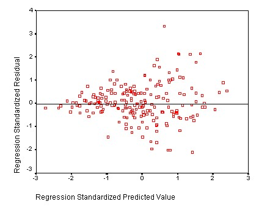

```{r, echo = FALSE, results = "hide"}
include_supplement("uu-Homoscedasticity-025-nl-tabel.jpg", recursive = TRUE)
```

Question
========
  
There is heteroscedasticity if...

Answerlist
----------
* ... the explanatory variables are highly correlated among themselves
* ... the measurement errors ('errors') are not normally distributed
* ... the relationship between at least 1 of the X variables and the Y variable is nonlinear
* ... the variance of the measurement errors ('errors') is not constant across the scores of the X variable(s) 

Solution
========
In regression analyses the condition of homoscedasticity applies: The variance in y is the same for all values of x. When the variance of measurement errors is not constant across scores of x we speak of heteroscedasticity (see figure below).



Meta-information
================
exname: uu-Homoscedasticity-025-en
extype: schoice
exsolution: 0001
exsection: Assumptions/Homoscedasticity
exextra[Type]: Interpreting graph
exextra[Program]: SPSS
exextra[Language]: English
exextra[Level]: Statistical Literacy
