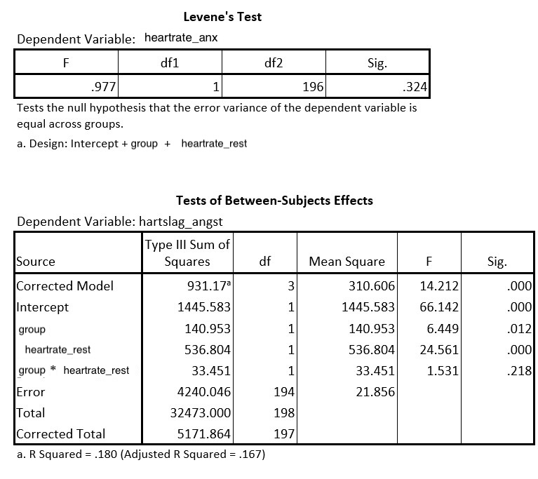

```{r, echo = FALSE, results = "hide"}
include_supplement("uu-Levenes-test-024-nl-tabel.jpg", recursive = TRUE)
```


Question
========
A group of researchers are interested in the differences in heart rate in anxiety situations, between people with phobia and those without. They want to perform a covariance analysis controlling for heart rate at rest. Among other things, they get the following output:



Is the assumption for homogeneity of regression coefficients met?

Answerlist
----------
* Yes, because p = .324
* Yes, because p = .218
* No, because p = .324
* No, because p = .218

Solution
========


Meta-information
================
exname: uu-Levene's-test-024-en.Rmd
extype: schoice
exsolution: 0100
exsection: Assumptions/Homogeneity of variance/Levene's test
exextra[Type]: Interpreting output
exextra[Program]: SPSS
exextra[Language]: English
exextra[Level]: Statistical Literacy
