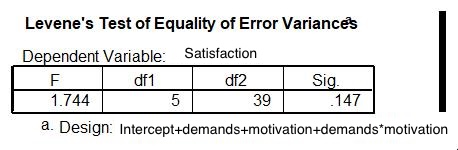

```{r, echo = FALSE, results = "hide"}
include_supplement("uu-Levenes-test-201-en-tabel.jpg", recursive = TRUE)
```

Question
========
What is the correct conclusion based on the output below? 



Answerlist
----------
* Levene's test shows that the condition of equal distribution is not met.
* Levene's test shows that the condition of equal distribution is met.
* Levene's test shows that the condition of normality is not met.
* Levene's test shows that the condition of normality is met.


Solution
========

Meta-information
================
exname: uu-Levene's-test-201-en
extype: schoice
exsolution: 0100
exsection: Assumptions/Homogeneity of variance/Levene's test
exextra[ID]: c2e6b
exextra[Type]: Interpreting output
exextra[Program]: SPSS
exextra[Language]: English
exextra[Level]: Statistical Literacy
