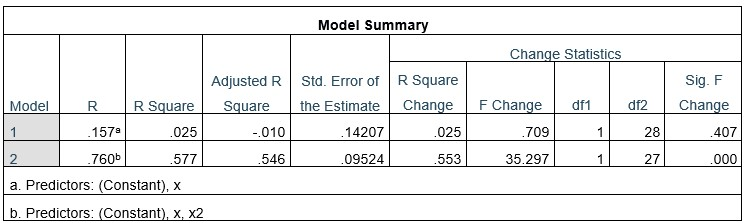

```{r, echo = FALSE, results = "hide"}
include_supplement("uu-Linearity-800-nl-tabel.jpg", recursive = TRUE)
```

Question
========
  
In een regressieanalyse om de afhankelijke variabele Y te voorspellen op basis van voorspeller X, wordt de lineariteit assumptie gecontroleerd. De volgende uitvoer is beschikbaar:


  
Answerlist
----------
* F-verandering is significant, dus aan de lineariteit assumptie is voldaan.
* F-verandering is significant, dus aan de lineariteit assumptie is niet voldaan.  
* F-verandering is niet significant, dus aan de lineariteit assumptie is voldaan.
* F-verandering is niet significant, dus aan de lineariteitshypothese is niet voldaan. 

Solution
========
De F-verandering (tussen model 1 en model 2) is significant, wat aangeeft dat het toevoegen van x-kwadraat een significante verbetering van het model is en dat daarom niet aan de assumptie van lineariteit wordt voldaan.

Meta-information
================
exname: uu-Linearity-800-nl
extype: schoice
exsolution: 0100
exsection: Assumptions/Linearity
exextra[ID]: 8ec33
exextra[Type]: Interpreting output
exextra[Program]: SPSS
exextra[Language]: Dutch
exextra[Level]: Statistical Literacy
