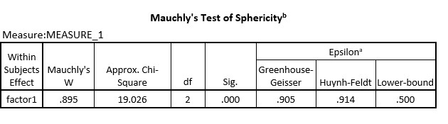

```{r, echo = FALSE, results = "hide"}
include_supplement("uu-Mauchlys-test-015-en-tabel.jpg", recursive = TRUE)
```

Question
========
In checking whether the conditions for repeated-measurement analysis are met, one finds the following data, among others:


  

What conclusion should be drawn?

Answerlist
----------
* There is sphericity (i.e. assumption met): no correction needs to be applied.
* There is sphericity (i.e. assumption not met): a correction must be applied.
* There is no sphericity (i.e. assumption not met): no correction must be applied.
* There is no sphericity (i.e., assumption not met): a correction must be applied.


Solution
========

Meta-information
================
exname: uu-Mauchly's-test-015-en
extype: schoice
exsolution: 0001
exsection: Assumptions/Sphericity/Mauchly's test
exextra[ID]: 2dde4
exextra[Type]: Interpreting output
exextra[Program]: SPSS
exextra[Language]: English
exextra[Level]: Statistical Literacy
