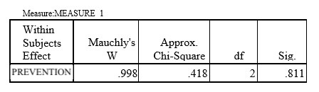

```{r, echo = FALSE, results = "hide"}
include_supplement("uu-Mauchlys-test-018-en-tabel.jpg", recursive = TRUE)
```

Question
========
There are quite a few deficiencies in children's sex education. A number of elementary school are now trying to break patterns and prevent sexual derailments. A prevention project Beauty and the beast is aimed at increasing the resilience of girls. The girls were given a questionnaire before, during and after the project that measured their resilience. Prior to testing whether resilience changed, one examines whether or not the assumption of sphericity was violated. The significance level at which the test is performed is 10%.



What conclusion do you draw from these results of the Mauchly's W test?

Answerlist
----------
* The assumption of sphericity is violated, because p ≤ alpha
* The assumption of sphericity is not violated, because p ≤ alpha
* The assumption of sphericity is violated, because p > alpha
* The assumption of sphericity is not violated, because p > alpha


Solution
========

Meta-information
================
exname: uu-Mauchly's-test-018-en
extype: schoice
exsolution: 0001
exsection: Assumptions/Sphericity/Mauchly's test
exextra[ID]: a5c82
exextra[Type]: Interpreting output
exextra[Program]: SPSS
exextra[Language]: English
exextra[Level]: Statistical Literacy
