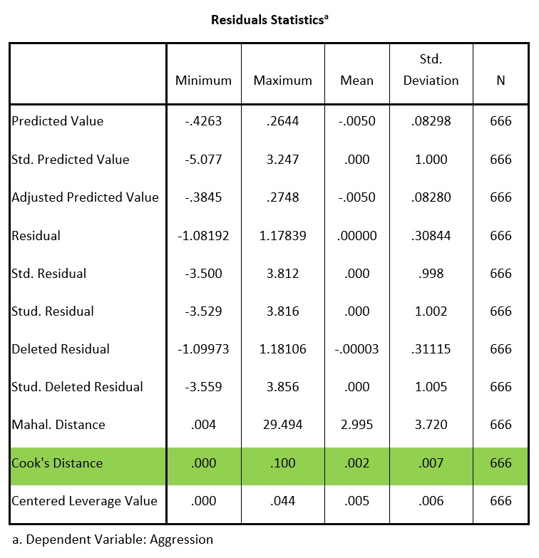

```{r, echo = FALSE, results = "hide"}
include_supplement("uu-assumptions-202-en-tabel.jpg", recursive = TRUE)
```


Question
========
To assess the assumptions for a regression analysis the table below is used.



Answerlist
----------
* The presence of outliers in the Y-space has been checked and the condition is not met. In other words, the analysis may not be carried out.
* The presence of outliers in the X-space has been checked and the condition has been met. In other words, the analysis may be carried out.
* The presence of outliers in the XY-space has been checked and the condition is met. In other words, the analysis may be carried out.
* The presence of multicollinearity has been checked and the condition is not met. In other words, the analysis may not be carried out.


Solution
========
Cook's distance is used to determine whether there are outliers in XY-space. The rule of thumb is that values below 1 do not indicate outliers. The maximum value of Cook's distance in this analysis is .100. This is lower than 1, so the assumption is met.


Meta-information
================
exname: uu-assumptions-202-en
extype: schoice
exsolution: 0010
exsection: Assumptions
exextra[Type]: Interpreting output
exextra[Program]: SPSS
exextra[Language]: English
exextra[Level]: Statistical Literacy
