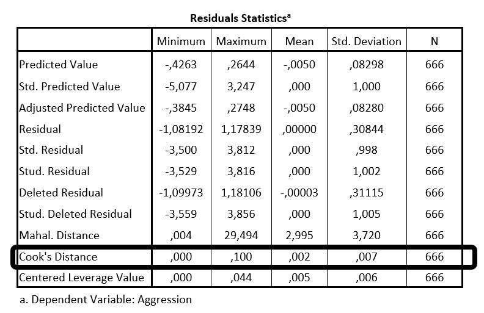

```{r, echo = FALSE, results = "hide"}
include_supplement("uu-assumptions-202-nl-tabel.jpg", recursive = TRUE)
```


Question
========
Om verder te kijken naar de voorwaarden voor de regressieanalyse is onderstaande tabel uitgedraaid. 



Welke conclusie kan getrokken worden op basis van de omcirkelde gegevens?

Answerlist
----------
* Er is gekeken of er sprake is van uitschieters in de Y-richting, er is niet voldaan aan de voorwaarde. Met andere woorden: De analyse mag niet uitgevoerd worden.
* Er is gekeken of er sprake is van uitschieters in de X-richting, er is voldaan aan de voorwaarde. Met andere woorden: De analyse mag wel uitgevoerd worden.
* Er is gekeken of er sprake is van uitschieters in het XY-vlak, er is voldaan aan de voorwaarde. Met andere woorden: De analyse mag wel uitgevoerd worden.
* Er is gekeken of er sprake is van multicollineariteit, er is niet voldaan aan de voorwaarde. Met andere woorden: De analyse mag niet uitgevoerd worden.


Solution
========
Met Cook’s distance wordt gekeken of er sprake is van uitschieters in XY-ruimte. De vuistregel is dat waardes lager dan 1 niet duiden op uitschieters. De maximale waarde van Cook’s distance in deze analyse is .100. Dit is lager dan 1, er is hier dus voldaan aan de voorwaarde.


Meta-information
================
exname: uu-assumptions-202-nl
extype: schoice
exsolution: 0010
exsection: Assumptions
exextra[Type]: Interpreting output
exextra[Program]: SPSS
exextra[Language]: Dutch
exextra[Level]: Statistical Literacy