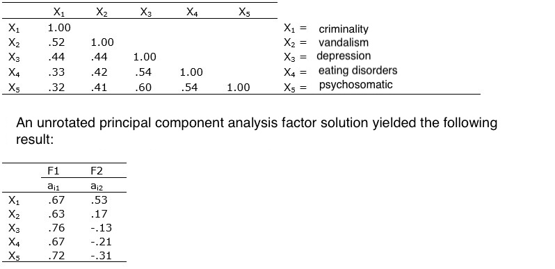

```{r, echo = FALSE, results = "hide"}
include_supplement("uu-Communalities-006-en-tabel.jpg", recursive = TRUE)
```


Question
========
A study of internalising and externalising problem behaviours (X1 to X5) in rural youth resulted in the following correlation matrix:



The communality h2 of variable X5 (PSYCHOSOMATIC) is equal to .61. 

Of which of the problem behaviours listed below is the explained variance of the two-factor solution higher?

Answerlist
----------
* X1 crime
* X2 vandalism
* X3 depression
* X4 eating disorders

Solution
========
Explanation: To calculate the explained variance of each variable, the communality for each variable needs to be calculated. To do this, the following formula is used:

$h^2_g = sum a^2_{gt} ,$ This formula indicates that the communality of a variable is the sum of its quantised factor loadings. Below, this is done for the four variables:

$h^2_{x1criminality} = .67^2 + .53^2 = .449+ .281 =.73$ 
$h^2_{x2vandalism} = .63^2 + .17^2 = .397 + .004 = .40$
$h^2_{x3depression} = .76^2 + -.13^2 = .578 + .017 =.60$
$h^2_{x4eatingdisorders} = .67^2 + -.21^2 = .449 + .044 = .49$


Meta-information
================
exname: uu-Communalities-006-en
extype: schoice
exsolution: 1000
exsection: Factor analysis/Communalities
exextra[Type]: Interpreting output
exextra[Language]: English
exextra[Level]: Statistical Literacy
