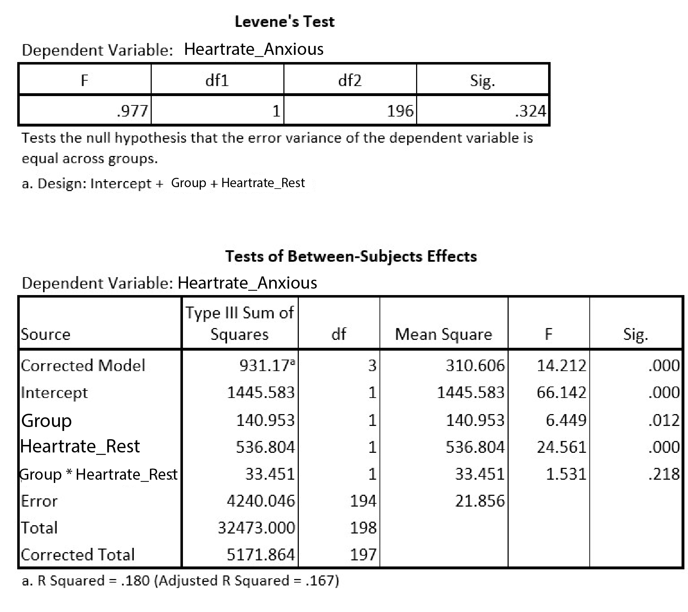

```{r, echo = FALSE, results = "hide"}
include_supplement("uu-Levenes-test-001-en-tabel.jpg", recursive = TRUE)
```

Question
========
A group of researchers are interested in the differences in heart rate in anxiety situations, between people with a phobia and people without a phobia. They want to perform a covariance analysis controlling for resting heart rate. Among the outputs they get are the following:



Answerlist
----------
* Yes, because p = .324
* Yes, because p = .218
* No, because p = .324
* No, because p = .218


Solution
========

Meta-information
================
exname: uu-Levene's test-001-en
extype: schoice
exsolution: 0100
exsection: Assumptions/Homogeneity of variance/Levene's test
exextra[Type]: Interpreting output
exextra[Program]: SPSS
exextra[Language]: English
exextra[Level]: Statistical Literacy
