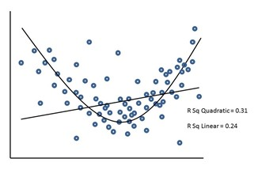

```{r, echo = FALSE, results = "hide"}
include_supplement("uu-linearity-001-nl-tabel.jpg", recursive = TRUE)
```

Question
========
The scatterplot below is part of a study among MBO students on the relationship between the amount of supervision from on-the-job trainers (X-axis) and students' development of independence (Y-axis).

Taking this scatterplot as a starting point, which assumption was clearly violated when analyzing the linear regression of guidance on independence?



Answerlist
----------
* Homoscedasticity
* Interval measurement level of dependent variable
* Multicollinearity
* Linearity


Solution
========
This figure shows that the linear solution has an explained variance of .24 (= $R^2$). However, the quadratic solution is better, with an explained variance of .31 (= $R^2$). This is actually higher, so the relationship between guidance and self-efficacy is seemingly not linear but quadratic. This violates the assumption of linearity.

Meta-information
================
exname: uu-linearity-001-en
extype: schoice
exsolution: 0001
exsection: Assumptions/Linearity
exextra[Type]: Interpreting graph
exextra[Program]: SPSS
exextra[Language]: English
exextra[Level]: Statistical Literacy
