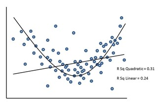

```{r, echo = FALSE, results = "hide"}
include_supplement("uu-linearity-001-en-tabel.jpg", recursive = TRUE)
```

Question
========
The scatter diagram below belongs to a study among MBO students on the relationship between the amount of guidance provided by practical trainers (X-axis) and students' development of independence (Y-axis).

Taking this scatter diagram as a starting point, which assumption was clearly violated when analysing the linear regression of guidance on independence?



Answerlist
----------
* homoscedasticity
* interval measurement level of dependent variable
* multicollinearity
* linearity

Solution
========
This figure shows that the linear solution has an explained variance of .24 (= $R^2$). However, the quadratic solution is better, with an explained variance of .31 (= $R^2$). This is actually higher, so the relationship between guidance and self-efficacy is apparently not linear but quadratic. This violates the assumption of linearity.


Meta-information
================
exname: uu-linearity-001-en.Rmd
extype: schoice
exsolution: 0001
exsection: Assumptions/Linearity
exextra[Type]: Interpreting graph
exextra[Program]: SPSS
exextra[Language]: English
exextra[Level]: Statistical Literacy
