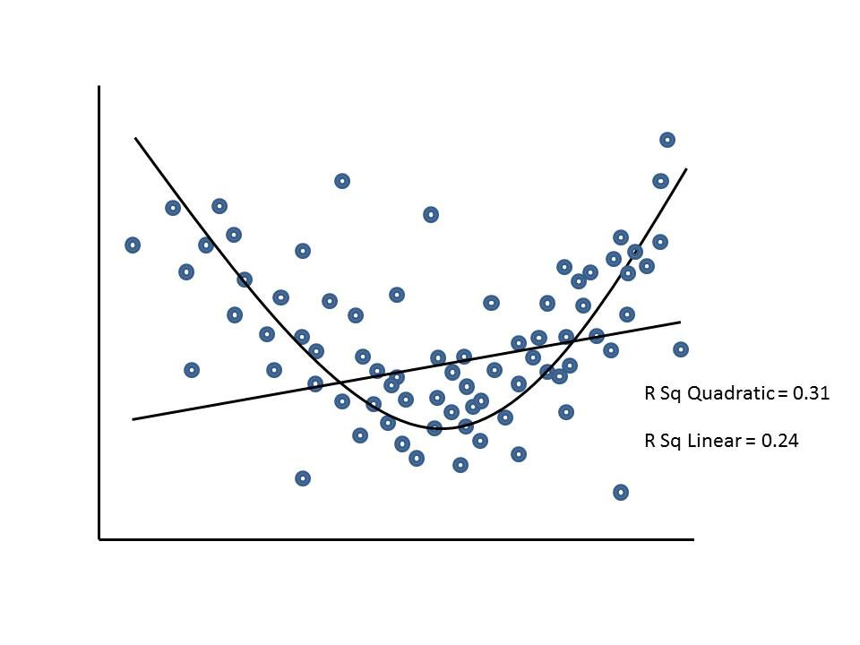

```{r, echo = FALSE, results = "hide"}
include_supplement("uu-linearity-006-nl-tabel.jpg", recursive = TRUE)
```


Question
========
The figure below is from a study among MBO students on the influence of the supervision of practical trainers on development of students' independence. The relationship between the amount of guidance (X-axis) and the development of independence (Y-axis) is shown in a scatterplot.

Taking this scatterplot as a starting point, what assumption is clearly violated when analyzing the linear regression of guidance on self-efficacy?



Answerlist
----------
* Homoscedasticity
* Linearity
* Multicollinearity
* Interval measurement level of the dependent variable


Solution
========

Meta-information
================
exname: uu-linearity-006-en
extype: schoice
exsolution: 0100
exsection: Assumptions/Linearity
exextra[Type]: Interpreting graph
exextra[Program]: SPSS
exextra[Language]: English
exextra[Level]: Statistical Literacy
