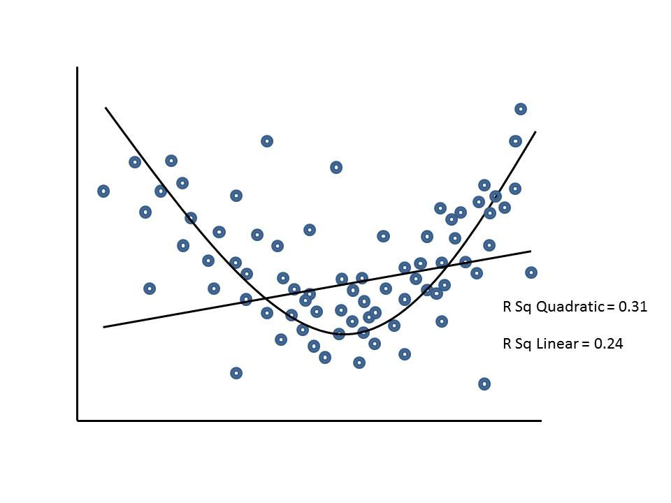

```{r, echo = FALSE, results = "hide"}
include_supplement("uu-linearity-006-nl-tabel.jpg", recursive = TRUE)
```


Question
========
De onderstaande figuur is afkomstig uit een onderzoek onder MBO-studenten naar de invloed van de begeleiding door praktijkdocenten op de ontwikkeling van de zelfstandigheid van studenten. De relatie tussen de hoeveelheid begeleiding (X-as) en de ontwikkeling van zelfstandigheid (Y-as) wordt weergegeven in een spreidingsdiagram.

Als we dit spreidingsdiagram als uitgangspunt nemen, welke aanname wordt dan duidelijk geschonden bij het analyseren van de lineaire regressie van begeleiding op zelfeffectiviteit?

Vertaald met DeepL.com (gratis versie)


Answerlist
----------
* Homoscedasticiteit
* Lineariteit
* Multicollineariteit
* Intervalmeetniveau van de afhankelijke variabele


Solution
========

Meta-information
================
exname: uu-linearity-006-nl
extype: schoice
exsolution: 0100
exsection: Assumptions/Linearity
exextra[ID]: 0d510
exextra[Type]: Interpreting graph
exextra[Program]: SPSS
exextra[Language]: English
exextra[Level]: Statistical Literacy
