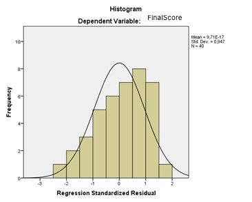

```{r, echo = FALSE, results = "hide"}
include_supplement("uu-normality-011-en-tabel.jpg", recursive = TRUE)
```


Question
========
Which assumption of regression analysis did Marco check with the graph below?



Answerlist
----------
* Linear relationship
* Homoscedasticity
* Sphericity
* For each X value, Y scores are normally distributed


Solution
========
With a histogram of the residuals, we can see whether, for each X value, the Y scores.

Answerlist
----------
* We can view the condition of linearity with a scatter plot.
* We can view the condition of homoscedasticity with a residuals plot.
* The condition of sphericity is not a condition for multiple regression, but for a repeated measures analysis, and we can view it with Mauchly's test.
* This is the correct answer!


Meta-information
================
exname: uu-normality-011-en.Rmd
extype: schoice
exsolution: 0001
exsection: Assumptions/Normality
exextra[Type]: Interpreting graph
exextra[Program]: SPSS
exextra[Language]: English
exextra[Level]: Statistical Literacy
