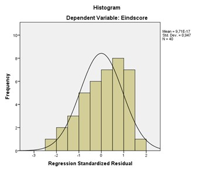

```{r, echo = FALSE, results = "hide"}
include_supplement("uu-normality-011-nl-tabel.jpg", recursive = TRUE)
```


Question
========
Welke voorwaarde van regressieanalyse heeft Marco gecontroleerd met onderstaande grafiek?



Answerlist
----------
* Lineaire relatie
* Homoscedasticiteit
* Sfericiteit
* Per X-waarde zijn de Y-scores normaal verdeeld


Solution
========
Met een histogram van de residuen kunnen we bekijken of per X-waarde de Y-scores .

Answerlist
----------
* De voorwaarde van een lineariteit kunnen we bekijken met een spreidingsdiagram.
* De voorwaarde van homoscedasticiteit kunnen we bekijken met een residuenplot.
* De voorwaarde van sfericiteit is geen voorwaarde voor multipele regressie, maar voor een herhaalde metingen analyse, en kunnen we bekijken met Mauchly's test.
* Dit is het juiste antwoord!


Meta-information
================
exname: uu-normality-011-nl.Rmd
extype: schoice
exsolution: 0001
exsection: Assumptions/Normality
exextra[ID]: 514f2
exextra[Type]: Interpreting graph
exextra[Program]: SPSS
exextra[Language]: Dutch
exextra[Level]: Statistical Literacy
