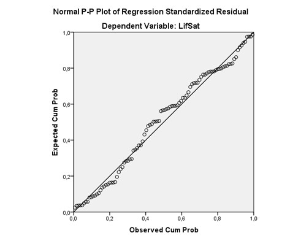

```{r, echo = FALSE, results = "hide"}
include_supplement("uu-residualplot-001-nl-tabel.jpg", recursive = TRUE)
```

Question
========
See figure below. This figure is created primarily to examine the presence of 



Answerlist
----------
* Normally distributed errors.
* Multicollinearity.
* Influential outliers.
* Heteroscedasticity.


Solution
========

A "Normal P-P plot" is used to check normality.

Meta-information
================
exname: uu-residual-plot-001-en
extype: schoice
exsolution: 1000
exsection: Assumptions/Homoscedasticity/Residual plot
exextra[Type]: Interpreting graph
exextra[Program]: SPSS
exextra[Language]: English
exextra[Level]: Statistical Literacy
