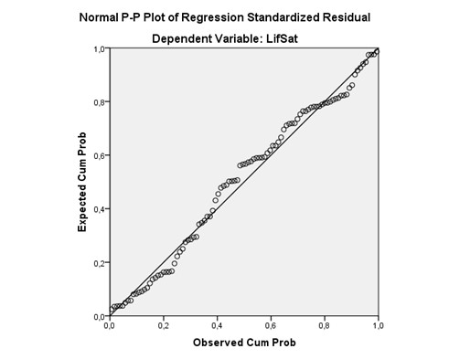

```{r, echo = FALSE, results = "hide"}
include_supplement("uu-residualplot-001-en-tabel.jpg", recursive = TRUE)
```

Question
========
See figure below. This figure is created primarily to examine whether there are any



Answerlist
----------
* normally distributed errors.
* multicollinearity.
* influential outliers.
* heteroscedasticity.


Solution
========

A ‘Normal P-P plot’ is used to check normality. 

Meta-information
================
exname: uu-residual-plot-001-en.Rmd
extype: schoice
exsolution: 1000
exsection: Assumptions/Homoscedasticity/Residual plot
exextra[Type]: Interpreting graph
exextra[Program]: SPSS
exextra[Language]: English
exextra[Level]: Statistical Literacy
