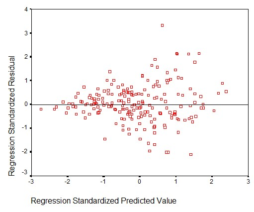

```{r, echo = FALSE, results = "hide"}
include_supplement("uu-residual-plot-002-nl-tabel.jpg", recursive = TRUE)
```

Question
========
The figure below refers to the variable age. Taking the figure below as a starting point, what assumption was violated when analyzing the linear regression of guidance on independence?



Answerlist
----------
* Homoscedasticity.
* Outlier in xy-space.
* Multicollinearity.
* Linearity.


Solution
========

Meta-information
================
exname: uu-residual-plot-002-en
extype: schoice
exsolution: 1000
exsection: Assumptions/Homoscedasticity/Residual plot
exextra[ID]: f71a8
exextra[Type]: Interpreting graph
exextra[Program]: SPSS
exextra[Language]: English
exextra[Level]: Statistical Literacy
