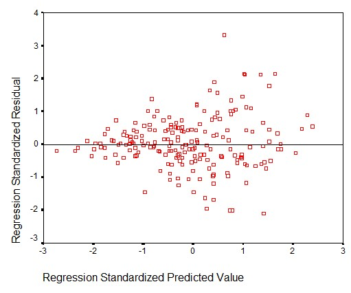

```{r, echo = FALSE, results = "hide"}
include_supplement("uu-residual-plot-002-nl-tabel.jpg", recursive = TRUE)
```


Question
========
Onderstaand figuur heeft betrekking op de variabele leeftijd. Wanneer je onderstaand figuur als uitgangspunt neemt, welke assumptie is bij analyse van de 	lineaire regressie van begeleiding op zelfstandigheid geschonden?



Answerlist
----------
* homoscedasticiteit.
* uitschieter in de xy-ruimte.
* multicollineariteit.
* lineariteit.


Solution
========


Meta-information
================
exname: uu-residual-plot-002-nl.Rmd
extype: schoice
exsolution: 1000
exsection: Assumptions/Homoscedasticity/Residual plot
exextra[ID]: fdd86
exextra[Type]: Interpreting graph
exextra[Program]: SPSS
exextra[Language]: Dutch
exextra[Level]: Statistical Literacy
