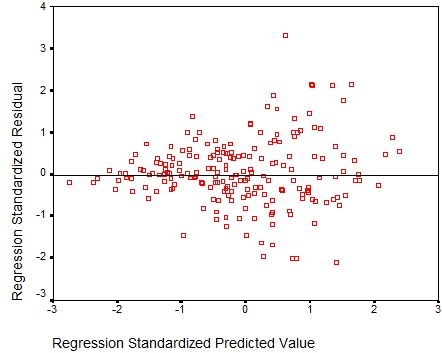

```{r, echo = FALSE, results = "hide"}
include_supplement("uu-residualplot-007-nl-tabel.jpg", recursive = TRUE)
```

Question
========
See figure below. This figure is created primarily to examine the presence of 



Answerlist
----------
* Non-normally distributed errors
* Multicollinearity
* Outliers
* Heteroscedasticity


Solution
========

Meta-information
================
exname: uu-residualplot-007-en
extype: schoice
exsolution: 0001
exsection: Assumptions/Homoscedasticity/Residual plot
exextra[Type]: Interpreting graph
exextra[Program]: SPSS
exextra[Language]: English
exextra[Level]: Statistical Literacy
