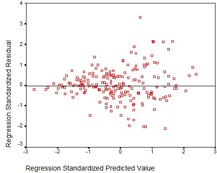

```{r, echo = FALSE, results = "hide"}
include_supplement("uu-residualplot-007-nl-tabel.jpg", recursive = TRUE)
```

Question
========
Zie onderstaande afbeelding. Deze afbeelding is voornamelijk gemaakt om de aanwezigheid van ... te controleren.


Answerlist
----------
* Niet-normaal verdeelde fouten
* Multicollineariteit
* Uitschieters
* Heteroscedasticiteit


Solution
========

Meta-information
================
exname: uu-residualplot-007-nl
extype: schoice
exsolution: 0001
exsection: Assumptions/Homoscedasticity/Residual plot
exextra[ID]: c08a0
exextra[Type]: Interpreting graph
exextra[Program]: SPSS
exextra[Language]: Dutch
exextra[Level]: Statistical Literacy
