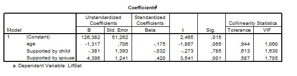

```{r, echo = FALSE, results = "hide"}
include_supplement("uu-Tolerance-020-en-table.jpg", recursive = TRUE)
```


Question
========
In a study the influence of Age, Supported by Child and Supported by Spouse on the life satisfaction of the elderly (LifSat) is studied. The following output is part of the results of the analyses.



Which conclusion is justified based on the output?

Answerlist
----------
* Linearity is a problem in this analysis because the Tolerance for all predictors is greater than .1.
* Linearity is not a problem in this analysis because the Tolerance for all predictors is greater than .1.
* Multicollinearity is a problem in this analysis because the Tolerance for all predictors is greater than .1.
* Multicollinearity is not a problem in this analysis because the Tolerance for all predictors is greater than .1.


Solution
========
Collinearity statistics provide information about multicollinearity, not linearity. The rule of thumb is that Tolerance values are less than. 1 indicate a problem. In this case, multicollinearity is not a problem because the tolerance for all predictive variables is greater than. 1.


Meta-information
================
exname: uu-Tolerance-020-en
extype: schoice
exsolution: 0001
exsection: Assumptions/Multicolinearity/Tolerance
exextra[Type]: Interpretating output
exextra[Program]: SPSS
exextra[Language]: English
exextra[Level]: Statistical Literacy