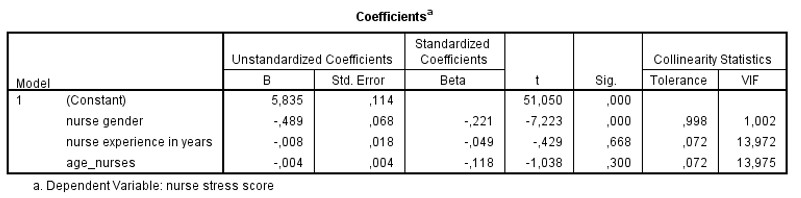

```{r, echo = FALSE, results = "hide"}
include_supplement("uu-VIF-001-en-tabel.jpg", recursive = TRUE)
```


Question
========
A researcher looks at the value of Tolerance to make a statement about possible collinearity of the variables. 
Which statement is correct given the results in the table below? 



I. The variable nurse gender should be removed from the regression model (Tolerance = .998).
II. The variables nurse experience and age_nurses should both be removed from the regression model (Tolerance of both = .072).

Answerlist
----------
* Both statements are correct
* Only statement I is correct
* Only statement II is correct
* Neither statement is correct


Solution
========
Based on the collinearity statistics, we can see if there are problems with multicollinearity. If the value of Tolerance is lower than .1, this is an indication that there is a problem. 
Statement I is incorrect, nurse gender has a value of Tolerance = .998, this is higher than .1. Hence, there is no problem with this variable. The statement that this variable should be removed is incorrect.
Statement II is also incorrect. Nurse experience and age_nurses both have a value of Tolerance = .072, this is less than .1. So there is a problem with these variables. The age of nurses is strongly related to the number of years of experience they have. The researcher is interested in both variables, but cannot include both of them in this way. Removing both variables from the model is incorrect, the researcher should choose one of the variables or merge the variables.

Meta-information
================
exname: uu-vif-001-en.Rmd
extype: schoice
exsolution: 0001
exsection: Assumptions/Multicolinearity/VIF
exextra[Type]: Interpreting output
exextra[Program]: SPSS
exextra[Language]: English
exextra[Level]: Statistical Literacy
