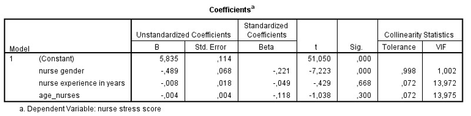

```{r, echo = FALSE, results = "hide"}
include_supplement("uu-VIF-001-nl-tabel.jpg", recursive = TRUE)
```


Question
========
Een andere onderzoeker is ook geïnteresseerd in het stress-niveau van verpleegkundigen maar heeft andere hypotheses. 
In onderstaande tabel staat de output van een regressieanalyse behorend bij de vraag of stress bij verpleegkundigen voorspeld kan worden door de variabelen leeftijd, ervaring (in jaren) en geslacht.
De onderzoeker kijkt naar de waarde van de Tolerance om een uitspraak te kunnen doen over mogelijke collineariteit van de variabelen. 
Welke uitspraak is correct gezien de uitkomsten in de onderstaande tabel? 




I. De variabele nurse gender moet uit het regressiemodel worden verwijderd (Tolerance = .998).
II. De variabelen nurse experience en age_nurses moeten allebei uit het regressiemodel worden verwijderd (Tolerance van beide = .072).

Answerlist
----------
* Beide uitspraken zijn correct
* Alleen uitspraak I is correct
* Alleen uitspraak II is correct
* Geen van beide uitspraken is correct


Solution
========
Op basis van de collinearity statistics kunnen we kijken of er problemen zijn met multicollinceariteit. Wanneer de waarde van Tolerance lager is dan .1 is dit een indicatie dat er een probleem is. 
Stelling I is onjuist, nurse gender heeft een waarde van Tolerance = .998, dit is hoger dan .1. Er is dus geen probleem met deze variabele. De stelling dat deze variabele verwijderd moet worden is onjuist.
Stelling II is ook onjuist. Nurse experience en age_nurses hebben beide een waarde van Tolerance = .072, dit is kleiner dan .1. Er is dus een probleem met deze variabelen. De leeftijd van verpleegkundigen is sterk gerelateerd aan het aantal jaar ervaring dat zij hebben. De onderzoeker is geïnteresseerd in beide variabelen, maar kan ze op deze manier niet beide meenemen. Beide variabelen uit het model verwijderen is onjuist, de onderzoeker moet één van de variabelen kiezen of de variabelen samenvoegen.


Meta-information
================
exname: uu-vif-001-nl
extype: schoice
exsolution: 0001
exsection: Assumptions/Multicolinearity/VIF
exextra[Type]: Interpreting output
exextra[Program]: SPSS
exextra[Language]: Dutch
exextra[Level]: Statistical Literacy
