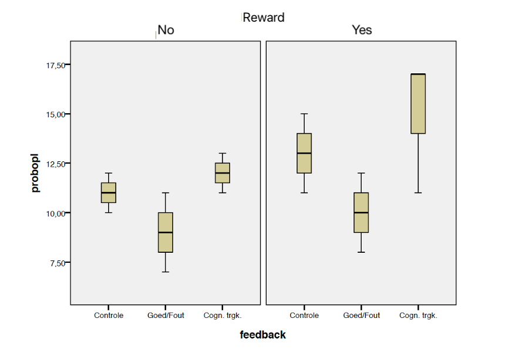

```{r, echo = FALSE, results = "hide"}
include_supplement("vufgb-assumptions-001-en.png", recursive = TRUE)
```

Question
========

We want to check assumptions of a two-way ANOVA. We do so by making a boxplot in each of the cells (*g* x *h*), see below. 



Which assumption(s) seem(s) to be violated?
  
  Answerlist
----------
* No assumptions.
* The assumption of normality in each of the cells.
* The assumption of equal variances for all cells.
* Both the assumption of normality and equal variances.

Meta-information
================
exname: vufgb-assumptions-001-en
extype: schoice
exsolution: 0001
exsection: Assumptions, Assumptions/Homogeneity of variance, Assumptions/Normality
exextra[Type]: Conceptual, Interpretating graph
exextra[Language]: English
exextra[Level]: Statistical Thinking