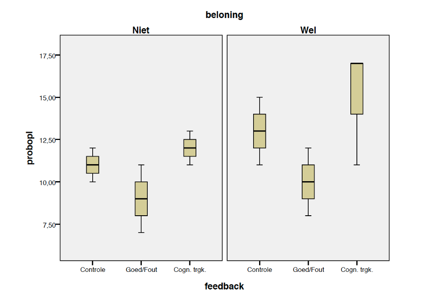

```{r, echo = FALSE, results = "hide"}
include_supplement("vufgb-assumptions-001-nl-graph-01.png", recursive = TRUE)
```

Question
========

We willen de assumpties van een tweewegs-ANOVA checken. Zodoende maken we een boxplot in elk van de cellen (*g* x *h*), zie hieronder.



Welke assumptie(s) lijkt/lijken te worden geschonden?
  
Answerlist
----------
* Geen enkele assumptie.
* De assumptie van normaliteit in elk van de cellen.
* De assumptie van gelijke varianties voor alle cellen.
* Zowel de assumptie van normaliteit als gelijke varianties.

Meta-information
================
exname: vufgb-assumptions-001-nl
extype: schoice
exsolution: 0001
exsection: Assumptions, Assumptions/Homogeneity of variance, Assumptions/Normality
exextra[Type]: Conceptual, Interpretating graph
exextra[Language]: Dutch
exextra[Level]: Statistical Thinking