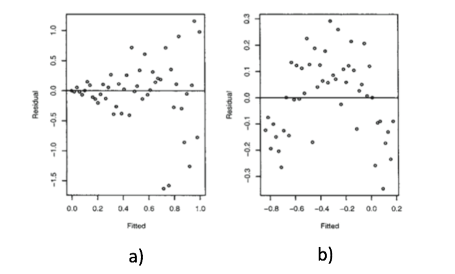

```{r, echo = FALSE, results = "hide"}
include_supplement("vufgb-assumptions-002-en-graph-01.png", recursive = TRUE)
```
Question
========
  
Provided are two residual plots. Complete the following sentence. In plot a) the assumption of ____ is violated and in plot b) the assumption of ____ is violated.

 
  
Answerlist
----------
* Linearity ;  Normality.
* Linearity; Homogeneity.
* Homogeneity ; Linearity.
* Normality ; Linearity.

Solution
========

Answerlist
----------
* Incorrect
* Incorrect
* Correct
* Incorrect

Meta-information
================
exname: vufgb-assumptions-002-en
extype: schoice
exsolution: 0010
exsection: Assumptions/Linearity, Assumptions/Homoscedasticity
exextra[Type]: Interpreting graph
exextra[Language]: English
exextra[Level]: Statistical Reasoning