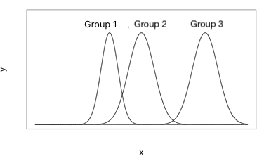

```{r, echo = FALSE, results = "hide"}
include_supplement("vufgb-homogeneityofvariance-001-en.png", recursive = TRUE)
```

Question
========
  The figure below depicts 3 population distributions. 



Which assumption of ANOVA with one factor (or: "group") is violated here?
  
Answerlist
----------
* That the population distributions are normally distributed.
* That the population variance in each group is the same.
* That the population distributions are independent.
* That the population mean in each group is the same.

Meta-information
================
exname: vufgb-homogeneityofvariance-001-en
extype: schoice
exsolution: 0100
exsection: Assumptions/Homogeneity of variance, Distributions/Continuous/Normal, Inferential Statistics/Parametric Techniques/ANOVA/Oneway ANOVA
exextra[ID]: f672d
exextra[Type]: Conceptual, Interpreting graph
exextra[Language]: English
exextra[Level]: Statistical Thinking
