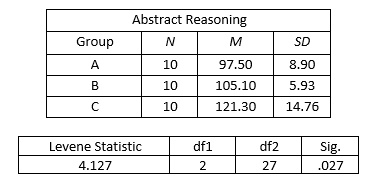

```{r, echo = FALSE, results = "hide"}
include_supplement("vufgb-homogeneityofvariance-003-en-table01.jpg", recursive = TRUE)
```

Question
========

See below some data of a study into abstract reasoning in three different groups. What can we deduce from these data?

Complete the following sentence. 

The ... of the three groups are significantly different, the assumption of ... is violated.


  
Answerlist
----------
* means; normality
* means; independent observations
* variances; homogeneity
* variances; multicollinearity

Solution
========

Answerlist
----------
* Incorrect
* Incorrect
* Correct
* Incorrect

Meta-information
================
exname: vufgb-homogeneityofvariance-003-en
extype: schoice
exsolution: 0010
exsection: Assumptions/Homogeneity of variance
exextra[Type]: Interpreting output, Conceptual
exextra[Program]: 
exextra[Language]: Dutch
exextra[Level]: Statistical Literacy