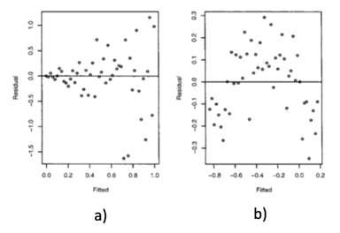

```{r, echo = FALSE, results = "hide"}
include_supplement("vufgb-homogeneityofvariance-005-en-figure01.jpg", recursive = TRUE)
```

Question
========

Given are two residual plots.

Complete.

In plot (a) the assumption of ... is violated
and in plot (b) the assumption of ...


  
Answerlist
----------
* linearity; normality
* linearity; homogeneity
* homogeneity; linearity
* normality; linearity

Solution
========

Answerlist
----------
* Incorrect
* Incorrect
* Correct
* Incorrect

Meta-information
================
exname: vufgb-homogeneityofvariance-005-en
extype: schoice
exsolution: 0010
exsection: Assumptions/Homogeneity of variance, Assumptions/Linearity
exextra[Type]: Interpreting graph
exextra[Program]: 
exextra[Language]: English
exextra[Level]: Statistical Literacy
