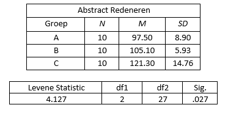

```{r, echo = FALSE, results = "hide"}
include_supplement("vufgb-homogeneityofvariance-006-nl-table01.jpg", recursive = TRUE)
```

Question
========

See below some data from a study of abstract reasoning in three different groups. What can we infer from these data?

Complete.

The ... of the three groups are significantly different, the assumption of ... is violated.


  
Answerlist
----------
* Averages; normality
* Averages; independent observations
* Variances; homogeneity
* Variances; multicollinearity

Solution
========

Answerlist
----------
* Incorrect
* Incorrect
* Correct
* Incorrect

Meta-information
================
exname: vufgb-homogeneityofvariance-006-en
extype: schoice
exsolution: 0010
exsection: Assumptions/Homogeneity of variance
exextra[ID]: 74819
exextra[Type]: Interpreting output
exextra[Program]: 
exextra[Language]: English
exextra[Level]: Statistical Literacy
