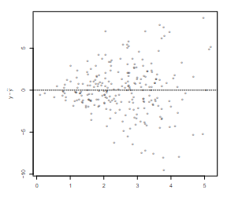

```{r, echo = FALSE, results = "hide"}
include_supplement("vufgb-homoscedasticity-001-en-scatterplot01.jpg", recursive = TRUE)
```

Question
========

A researcher performs a linear regression. First, he checks whether the assumptions of the linear regression model are met. He sees the following picture of residual scores.


  
Which assumption has been violated here?

Answerlist
----------
* Random draw.
* Homoscedasticity.
* Linear relationship between x and y.
* Conditional distribution of y is normally distributed.

Solution
========

Answerlist
----------
* Incorrect
* Correct
* Incorrect
* Incorrect

Meta-information
================
extype: schoice
exname: vufgb-homoscedasticity-001-en.Rmd
exsolution: 0100
exsection: Assumptions/Homoscedasticity, Assumptions, Descriptive statistics/Data representation/Graphs/Scatterplot
exextra[Type]: Interpreting graph
exextra[Program]: 
exextra[Language]: English
exextra[Level]: Statistical Literacy
