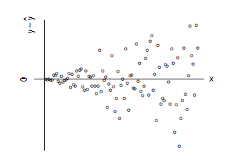

```{r, echo = FALSE, results = "hide"}
include_supplement("vufgb-homoscedasticity-002-nl-graph01.jpg", recursive = TRUE)
```

Question
========

Consider the residuals plot below. Which assumption of the general linear model is violated here?


  
Answerlist
----------
* Homogeneity of regression
* Sphericity
* Normality
* Homoscedasticity

Solution
========

Answerlist
----------
* Incorrect
* Incorrect
* Incorrect
* Correct

Meta-information
================
exname: vufgb-homoscedasticity-002-en
extype: schoice
exsolution: 0001
exsection: Assumptions/Homoscedasticity, Assumptions/Homoscedasticity/Residual plot, Assumptions
exextra[Type]: Interpreting graph
exextra[Program]: 
exextra[Language]: English
exextra[Level]: Statistical Literacy
