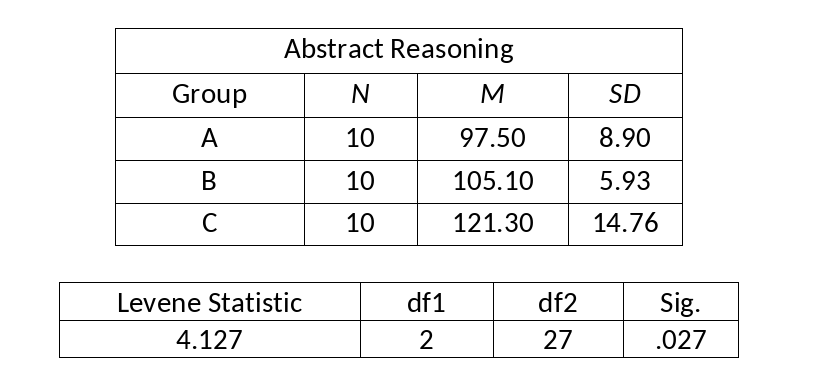

```{r, echo = FALSE, results = "hide"}
include_supplement("vufgb-levenstest-001-en-graph-01.png", recursive = TRUE)
```
Question
========
  
See below some data of a study into abstract reasoning in three different groups. What can we deduce from these data? Complete the following sentence. The _______ of the three groups are significantly different, the assumption of _______ is violated.


  
Answerlist
----------
* Means ; normality.
* Means ; independent observations.
* Variances ; homogeneity.
* Variances ; multicollinearity.

Solution
========

Answerlist
----------
* Incorrect
* Incorrect
* Correct
* Incorrect

Meta-information
================
exname: vufgb-levenstest-001-en
extype: schoice
exsolution: 0010
exsection: Assumptions/Homogeneity of variance/Levene's test
exextra[ID]: 61f3e
exextra[Type]: Interpreting output, Conceptual
exextra[Language]: English
exextra[Level]: Statistical Thinking
