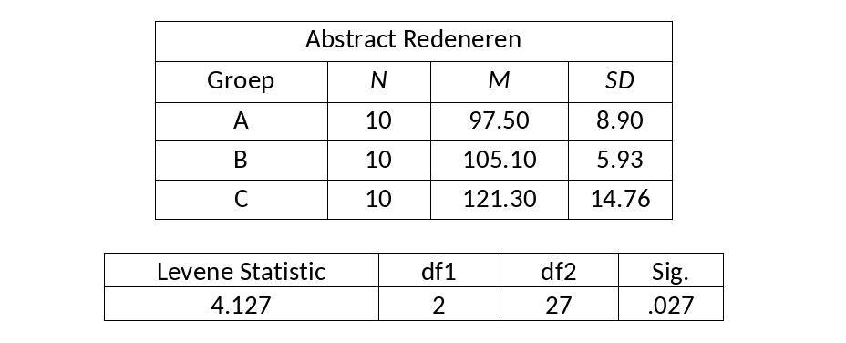

```{r, echo = FALSE, results = "hide"}
include_supplement("vufgb-levenstest-001-nl-graph-01.png", recursive = TRUE)
```
Question
========
  
Zie hieronder enkele gegevens van een studie naar abstract redeneren bij drie verschillende groepen. Wat kunnen we uit deze gegevens afleiden? Vul aan. De _______ van de drie groepen zijn significant verschillend, de assumptie van _______ wordt geschonden.


  
Answerlist
----------
* Gemiddeldes ; normaliteit
* Gemiddeldes ; onafhankelijke waarnemingen
* Varianties ; homogeniteit
* Varianties ; multicollineariteit

Solution
========

Answerlist
----------
* Incorrect
* Incorrect
* Correct
* Incorrect

Meta-information
================
exname: vufgb-levenstest-001-nl
extype: schoice
exsolution: 0010
exsection: Assumptions/Homogeneity of variance/Levene's test
exextra[ID]: 54428
exextra[Type]: Interpreting output, Conceptual
exextra[Language]: Dutch
exextra[Level]: Statistical Thinking
