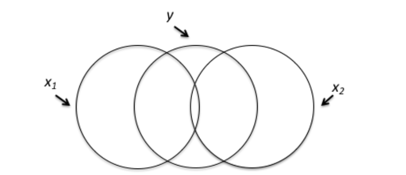

```{r, echo = FALSE, results = "hide"}
include_supplement("vufgb-multicolinearity-001-en-graph-01.png", recursive = TRUE)
```
Question
========
  
The Venn-diagram below visualizes which part of the variance in y is explained by the two predictors x_{1} and x_{2}. Which conclusion about the Venn-diagram is correct?


  
Answerlist
----------
* There is hardly any multicolinearity.
* There is a low coefficient of multiple determination R^{2}.
* There is a low multiple correlation *R*.
* There is considerable interaction.

Solution
========

Answerlist
----------
* Correct
* Incorrect
* Incorrect
* Incorrect

Meta-information
================
exname: vufgb-multicolinearity-001-en
extype: schoice
exsolution: 1000
exsection: Assumptions/Multicolinearity
exextra[Type]: Conceptual
exextra[Language]: English
exextra[Level]: Statistical Reasoning
