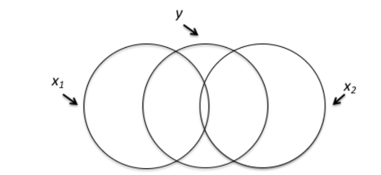

```{r, echo = FALSE, results = "hide"}
include_supplement("vufgb-multicolinearity-001-nl-graph-01.png", recursive = TRUE)
```
Question
========
  
Onderstaand Venn-diagram geeft weer welk deel van de variantie in y verklaard wordt door de twee predictoren x1 en x2. Welke conclusie over het Venn-diagram is juist?


  
Answerlist
----------
* Er is nauwelijks sprake van multicollineariteit.
* Er is sprake van een lage coëfficiënt van multipele determinatie R^{2}.
* Er is sprake van een lage multipele correlatie *R*.
* Er is sprake van aanzienlijke interactie.

Solution
========

Answerlist
----------
* Correct
* Incorrect
* Incorrect
* Incorrect

Meta-information
================
exname: vufgb-multicolinearity-001-nl
extype: schoice
exsolution: 1000
exsection: Assumptions/Multicolinearity
exextra[Type]: Conceptual
exextra[Language]: Dutch
exextra[Level]: Statistical Reasoning
