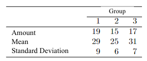

```{r, echo = FALSE, results = "hide"}
include_supplement("vufgb-multicolinearity-004-en-table01.jpg", recursive = TRUE)
```

Question
========

In a study, a questionnaire is administered at different times of the year. Group 1 takes the test in January, Group 2 in May and Group 3 in September. A total of 51 people participate. The table below shows the mean on the test, number of observations and standard deviation for each group.


  
Which of the following statements is correct? If there is multicollinearity then... 
  
Answerlist
----------
* ...omitting one of the predictors leads to a relatively large decrease in $R^{2}$.
* ...a model with significant $R^{2}$ can give large P-values for the predictors.
* ...will artificially lower the standard errors of the estimated regression parameters.
* ...the Variance Inflation Factors (VIFs) will be relatively low.

Solution
========

Answerlist
----------
* Incorrect
* Correct
* Incorrect
* Incorrect

Meta-information
================
exname: vufgb-multicolinearity-004-en
extype: schoice
exsolution: 0100
exsection: Assumptions/Multicolinearity, Inferential Statistics/Regression/R squared, Inferential Statistics/NHST/p-value
exextra[Type]: Conceptual
exextra[Program]: 
exextra[Language]: English
exextra[Level]: Statistical Literacy
