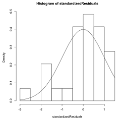

```{r, echo = FALSE, results = "hide"}
include_supplement("vufgb-normality-001-nl-histogram01.jpg", recursive = TRUE)
```

Question
========

Given is the residual plot below. Which assumption seems violated?


  
Answerlist
----------
* Linearity
* Normality
* Homogeneity
* Random draw


Solution
========

Answerlist
----------
* Incorrect
* Correct
* Incorrect
* Incorrect

Meta-information
================
exname: vufgb-normality-001-en
extype: schoice
exsolution: 0100
exsection: Assumptions/Normality, Descriptive statistics/Data representation/Graphs/Histogram
exextra[Type]: Interpreting graph, Conceptual
exextra[Program]: 
exextra[Language]: English
exextra[Level]: Statistical Literacy
