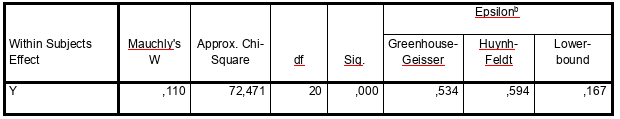

```{r, echo = FALSE, results = "hide"}
include_supplement("vufgb-sphericity-003-en-table01.jpg", recursive = TRUE)
```

Question
========

The results of the Mauchly's test for sphericity in a repeated measures ANOVA are shown in the table below. 

Which conclusion is correct?


  
Answerlist
----------
* Sphericity assumption is not violated, Greenhouse-Geisser correction is recommended.
* Sphericity assumption is violated, Greenhouse-Geisser correction is recommended.
* Sphericity assumption is not violated, Huynh-Feldt correction is recommended.
* Sphericity assumption is violated, Huynh-Feldt correction is recommended.

Solution
========

Answerlist
----------
* Incorrect
* Correct
* Incorrect
* Incorrect

Meta-information
================
exname: vufgb-sphericity-003-en
extype: schoice
exsolution: 0100
exsection: Assumptions/Sphericity, Assumptions/Sphericity/Mauchly's test, Inferential Statistics/Parametric Techniques/ANOVA/Oneway repeated measures ANOVA
exextra[Type]: Interpreting output
exextra[Program]: 
exextra[Language]: English
exextra[Level]: Statistical Literacy
