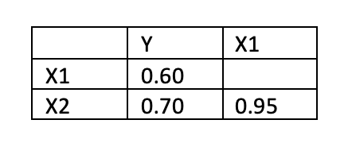

```{r, echo = FALSE, results = "hide"}
include_supplement("vufgb-vif-002-nl-graph-01.png", recursive = TRUE)
```
Question
========
  
In een meervoudig regressiemodel wordt Y voorspeld aan hand van predictoren X1 en X2. Hieronder staan de correlaties tussen de variabelen. Bereken de Variance Inflation Factor (VIF).

 
  
Answerlist
----------
* 1.56.
* 1.96.
* 2.29.
* 10.26.

Solution
========

Answerlist
----------
* Incorrect
* Incorrect
* Incorrect
* Correct

Meta-information
================
exname: vufgb-vif-002-nl
extype: schoice
exsolution: 0001
exsection: Assumptions/Multicolinearity/VIF
exextra[ID]: 0d487
exextra[Type]: Calculation
exextra[Language]: Dutch
exextra[Level]: Statistical Thinking
