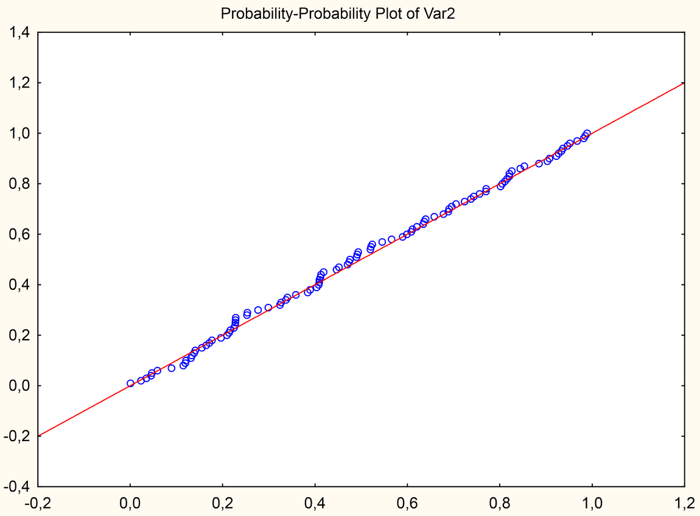

```{r, echo = FALSE, results = "hide"}
include_supplement("ppplot.png")
include_supplement("residuals.png")
```

Question
========
Which regression assumption is **not**violated according to the figures
presented below?  


Answerlist
----------
* The assumption of homoscedasticity because the variance of the residuals
  does not seem to vary for the different predicted values
* The assumption of the normality of the residuals because in the P-P plot
  the P(Z&gt;z) of the distribution of our data does not differ from the
  theoretical normal distribution
* The assumption of linearity because the variance of the residuals does
  not seem to vary for the different predicted values
* The assumption of the normality of the dependent variable because in the
  P-P plot the P(Z&gt;z) of the distribution of our data does not differ
  from the theoretical normal distribution

Solution
========


For the assumption of homoscedasticity, we look at whether the variance
of the residuals varies across the different predicted values. The
variance of residuals seems to vary considerably as we move from the
left to the right part of the graph. Therefore, also the assumption of
homoscedasticity is violated.  
For the assumption of linearity, we would need to look at whether there
is a pattern in the scatterplot and specifically whether the points are
evenly spread above and below the 0-line. This is not the case, so
linearity is violated.  
The assumption of normality refers to the normality of residuals and not
the dependent variable. To assess the normality of residuals we use the
P-P plot where our data should be close to the 45-degree line which
corresponds to the theoretical normal distribution. This seems to be the
case, so the assumption of normality of residuals is approximately met.


Language  
English

M&T MVA  
Standaardwaarde

M&T Regression assumptions  
Default value
Answerlist
----------
* False
* True
* False
* False

Meta-information
================
exname: vufsw-assumptions-1004-en
extype: schoice
exsolution: 0100
exshuffle: TRUE
exsection: inferential statistics/regression/assumptions
exextra[Type]: interpretating graph
exextra[Program]: NA
exextra[Language]: English
exextra[Level]: statistical reasoning

