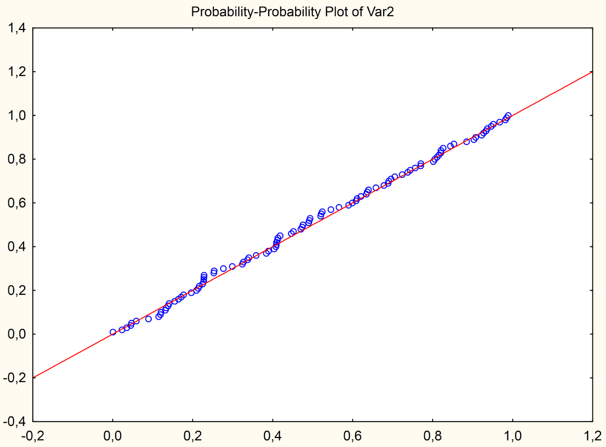
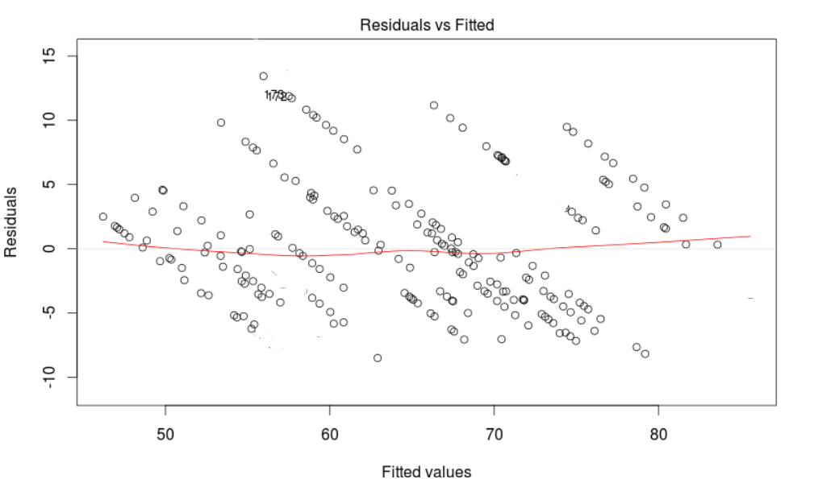

```{r, echo = FALSE, results = "hide"}
include_supplement("ppplot.png", recursive = TRUE)
include_supplement("residuals.png", recursive = TRUE)
```

Question
========
Welke regressie assumptie is **niet** geschonden volgens de figuren hieronder gepresenteerd?  


Answerlist
----------
* De assumptie van homoscedasticiteit omdat de variantie van de residuen niet lijkt te variëren voor de verschillende voorspelde waarden
* De assumptie van normaliteit van de residuen omdat in de P-P plot de P(Z&gt;z) van de verdeling van onze data niet afwijkt van de theoretische normale verdeling
* De assumptie van lineariteit omdat de variantie van de residuen niet lijkt te variëren voor de verschillende voorspelde waarden
* De assumptie van normaliteit van de afhankelijke variabele omdat in de P-P plot de P(Z&gt;z) van de verdeling van onze gegevens niet afwijkt van de theoretische normale verdeling

Solution
========

Voor de assumptie van homoscedasticiteit kijken we of de variantie van de residuen varieert over de verschillende voorspelde waarden. De variantie van de residuen lijkt aanzienlijk te variëren als we van het linker naar het rechter deel van de grafiek. Daarom wordt ook de assumptie van homoscedasticiteit geschonden.  
Voor de assumptie van lineariteit zouden we moeten kijken of er een patroon is in de scatterplot en specifiek of de punten gelijkmatig verdeeld zijn boven en onder de 0-lijn. Dit is niet het geval, dus is de lineariteit geschonden.  
De assumptie van normaliteit verwijst naar de normaliteit van de residuen en niet naar de afhankelijke variabele. de afhankelijke variabele. Om de normaliteit van residuen te beoordelen, gebruiken we de P-P-plot waar onze gegevens dicht bij de lijn van 45 graden moeten liggen die overeenkomt met de theoretische normale verdeling. Dit lijkt het geval te zijn, dus er wordt bij benadering voldaan aan de assumptie van normaliteit van residuen.

Taal Engels

M&T MVA Standaardwaarde

M&T Regressie assumpties Standaardwaarde
Answerlist
----------
* Onwaar
* Waar
* Onwaar
* Onwaar

Meta-information
================
exname: vufsw-assumptions-1004-nl
extype: schoice
exsolution: 0100
exshuffle: TRUE
exsection: inferential statistics/regression/assumptions
exextra[Type]: interpretating graph
exextra[Program]: NA
exextra[Language]: Dutch
exextra[Level]: statistical reasoning

