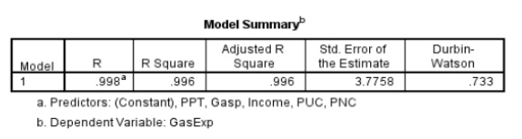

```{r, echo = FALSE, results = "hide"}
include_supplement("durbinwatson.png", recursive = TRUE)
```

Question
========
Deze tabel laat zien of aan een van de aannames van lineaire regressie **niet** is voldaan. Welke aanname is dat?  
  


Answerlist
----------
* Onafhankelijkheid van **errors**
* Multicollineariteit
* Homoscedasticiteit
* Normaliteit van residuen

Solution
========
Deze tabel toont de Durbin-Watson test, die test op de onafhankelijkheid van fouten (autocorrelatie).

Answerlist
----------
* True
* False
* False
* False

Meta-information
================
exname: vufsw-assumptions-1009-nl
extype: schoice
exsolution: 1000
exshuffle: TRUE
exsection: inferential statistics/regression/assumptions
exextra[Type]: interpretating output
exextra[Program]: NA
exextra[Language]: Dutch
exextra[Level]: statistical reasoning

