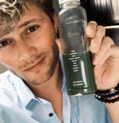

```{r, echo = FALSE, results = "hide"}
include_supplement("1602957985289.png", recursive = TRUE)
include_supplement("1602958004820.png", recursive = TRUE)
include_supplement("1602957955060.png", recursive = TRUE)
include_supplement("1602957967127.png", recursive = TRUE)
```

Question
========
In an experiment on the effect of food marketing on purchase intentions (Laura Sjardin, Josephine Ruijs, Nora Michon and Lianne van der Poel, 2017), 92 respondents were shown a photo on Instagram of a healthy fruit juice via an online survey. In the photo of one (random) half of the respondents, the juice was shown by a Dutch celebrity (Tim Douwsma, left photo), on that of the other half by an unknown Dutch person (right photo). Respondents then had to indicate to what extent they would intend to buy the juice (‘buying’: a higher score means a higher buying intention). The question was whether showing the juice by a famous Dutchman would lead to a higher buying intention than showing the juice by an unknown Dutchman.
  
 

  

  
Can we assume that the assumption of homogeneity of the variance is not violated? By what p-value do you infer this?

Answerlist
----------
* Yes, we can assume that, this can be deduced from the p = .870
* No, we can't assume that, this can be deduced from the p = .870
* Yes, we can assume that, this can be deduced from the p = .341
* No, we can't assume that, this can be deduced from the p = .341

Solution
========

Answerlist
----------
* True
* False
* False
* False

Meta-information
================
exname: vufsw-levene's test-1381-en
extype: schoice
exsolution: 1000
exshuffle: TRUE
exsection: assumptions/homogeneity of variance/levene's test
exextra[Type]: interpreting output
exextra[Program]: NA
exextra[Language]: English
exextra[Level]: statistical literacy

