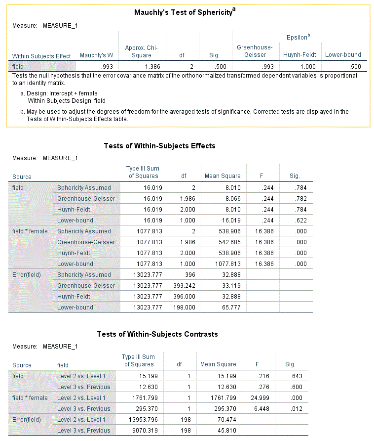
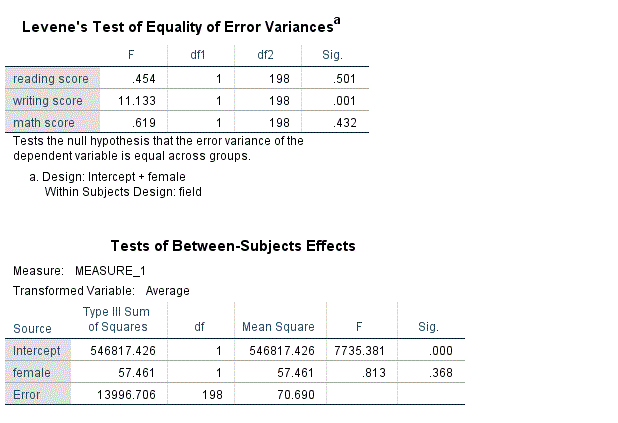

```{r, echo = FALSE, results = "hide"}
include_supplement("Capture.gif", recursive = TRUE)
include_supplement("Capture1.gif", recursive = TRUE)
```

Question
========
We analyseren of de prestaties van leerlingen verschillen tussen drie vakken: literatuur, essay schrijven en wiskunde (ze staan in deze volgorde in de dataset). Daarnaast onderzoeken we of er verschillen zijn tussen de drie vakken tussen mannelijke en vrouwelijke scholieren. Daarom gebruiken we een gemengde ANOVA-ontwerp. 
De output van deze analyse wordt hieronder weergegeven. “**Vrouw**” is gecodeerd als 0: man, 1: vrouw.
Is de aanname van homogeniteit van varianties geschonden (zie output hieronder)?
  



Answerlist
----------
* Ja, voor schrijfvaardigheid
* Ja, voor leesvaardigheid
* Ja, voor rekenen
* Nee, voor geen enkel vak.

Solution
========

Answerlist
----------
* True
* False
* False
* False

Meta-information
================
exname: vufsw-levene'stest-0306-nl
extype: schoice
exsolution: 1000
exshuffle: TRUE
exsection: assumptions/homogeneity of variance/levene's test
exextra[Type]: conceptual
exextra[Program]: NA
exextra[Language]: Dutch
exextra[Level]: statistical reasoning

