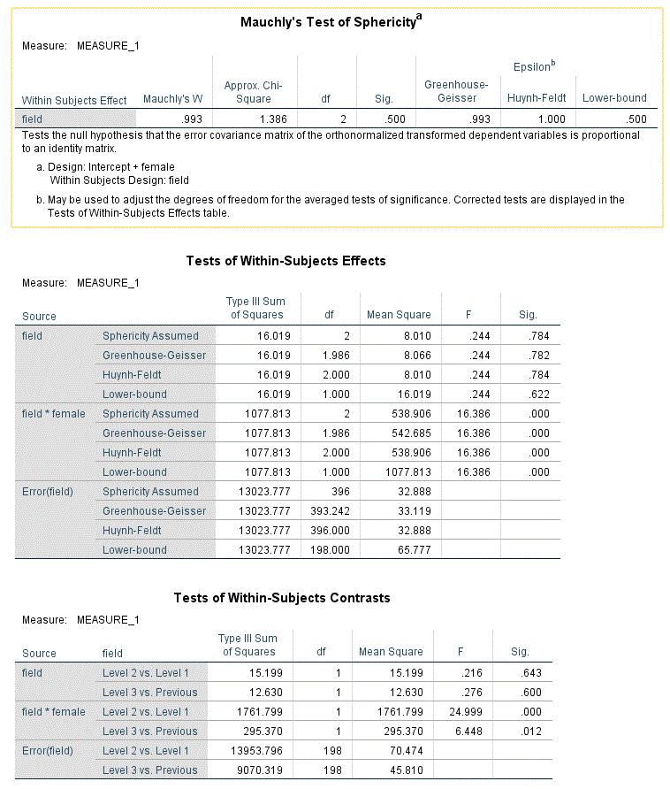

```{r, echo = FALSE, results = "hide"}
include_supplement("Capture.gif", recursive = TRUE)
include_supplement("Capture1.gif", recursive = TRUE)
```

Question
========
We analyze whether students' performance differs between 3 subjects: literature, essay writing and mathematics (they appear in this order in the dataset). In addition, we examine whether any differences between the 3 subjects vary between male and female schoolchildren. Therefore, we use a Mixed Design ANOVA. The output of this analysis is shown below. "**Female**" is coded as 0: male, 1: female.  
In the output below, if the assumption of homogeneity of the variances violated, what F-value would this indicate?  
* Ound to 3 decimal places, record a 0 if the assumption is not violated is.*  
  



Solution
========

Meta-information
================
exname: vufsw-levene'stest-0307-en
extype: num
exsolution: 11.133
extol: 0
exsection: assumptions/homogeneity of variance/levene's test
exextra[Type]: conceptual
exextra[Program]: NA
exextra[Language]: English
exextra[Level]: statistical reasoning

