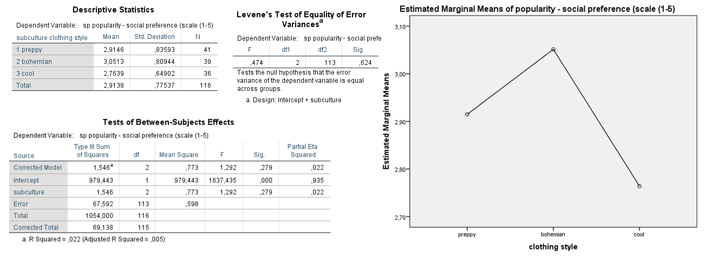

```{r, echo = FALSE, results = "hide"}
include_supplement("Untitled.png", recursive = TRUE)
```

Question
========
In a study by Communication Studies students (Van Dun, Emanuels, Visser and De Wilde, 2011), respondents were presented with a picture of a girl who was dressed preppy, bohemian or cool (variable: subculture, 1 preppy; 2 bohemian; 3 cool ('cool')). Respondents, randomly assigned to the three conditions, had to rate the popularity of the girl. The dependent variable is popularity in terms of 'social preference ' with items such as "With this girl .... "I would like to hang out with," and .... "would I want to be friends with" (variable: sp, scale 1-5, a higher score means the girl is more popular). The hypothesis is that clothing style leads to different ratings of the girl's popularity. Below are some results of an ANOVA. 



According to the test in question, is the assumption of equal variances in the groups is met? From which number do you infer that?

Answerlist
----------
* Yes, I infer that from *F*(2,113) = .474, *p* = .624
* No, I deduce that from *F*(2,113) = .474, *p* = .624
* Yes, I infer that from *F*(2,113) = 1.292, *p* = .279
* No, I infer that from *F*(2,113) = 1.292, *p* = .279

Solution
========

Answerlist
----------
* True
* False
* False
* False

Meta-information
================
exname: vufsw-levenestest-1288-en
extype: schoice
exsolution: 1000
exshuffle: TRUE
exsection: assumptions/homogeneity of variance/levene's test
exextra[ID]: f2bd8
exextra[Type]: interpreting output
exextra[Program]: spss
exextra[Language]: English
exextra[Level]: statistical literacy

