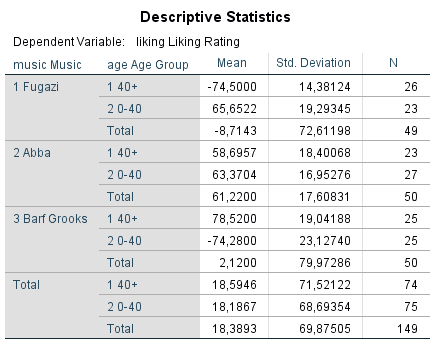
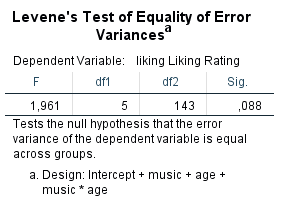
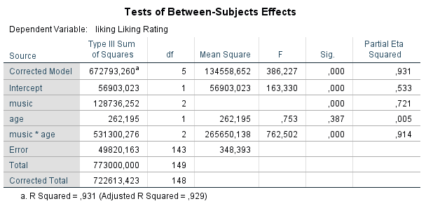
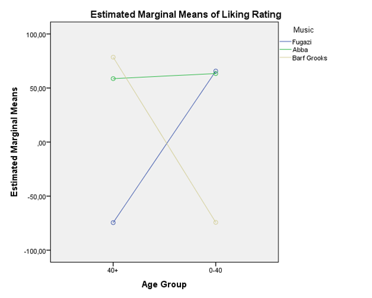
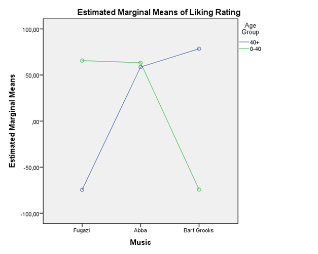

```{r, echo = FALSE, results = "hide"}
include_supplement("1602950529966.png", recursive = TRUE)
include_supplement("1602950556931.png", recursive = TRUE)
include_supplement("1602950597019.png", recursive = TRUE)
include_supplement("1602950627758.png", recursive = TRUE)
include_supplement("1602950646258.png", recursive = TRUE)
```

Question
========
Do your music tastes change as you get older? Field expects so and studies this by distinguishing two age groups in an experiment: young adults under 40 and older people, over 40 (variable: age). Both age groups are also randomly split into three smaller groups, and these have to listen to music by Fugazo, Abba, or Barf Grooks (variable: music). Each participant rates the music on a scale from -100 to +100 (variable: liking, a higher score means higher ‘liking’).

 

  
  

  
The ‘variance ratio’ is a way of exploring the assumption of the homogeneity of variances. In this study, 3 is the limit for how many times larger the largest ‘within-group’ variance may be
relative to the smallest ‘within-group’ variance.   

**Variance ratio = largest ‘within-group variance’/ smallest within-group variance'** 

According to the ‘variance ratio’, is the assumption of homogeneity of variances met?

Answerlist
----------
* The variance ratio is about 2.6, smaller than 3, therefore we cannot assume equal ‘within-group’ variance between groups
* The variance ratio is about 2.6, smaller than 3, therefore we can assume equal ‘within-group’ variance between the groups
* The variance ratio is about 1.6, smaller than 3, therefore we cannot assume equal ‘within-group’ variance between the groups
* The variance ratio is about 1.6, smaller than 3, therefore we can assume equal ‘within-group’ variance between the groups

Solution
========

Answerlist
----------
* False
* True
* False
* False

Meta-information
================
exname: vufsw-ratio of variance-1377-en
extype: schoice
exsolution: 0100
exshuffle: TRUE
exsection: assumptions/homogeneity of variance/ratio of variance
exextra[ID]: ba529
exextra[Type]: interpreting output
exextra[Program]: calculator
exextra[Language]: English
exextra[Level]: statistical thinking

